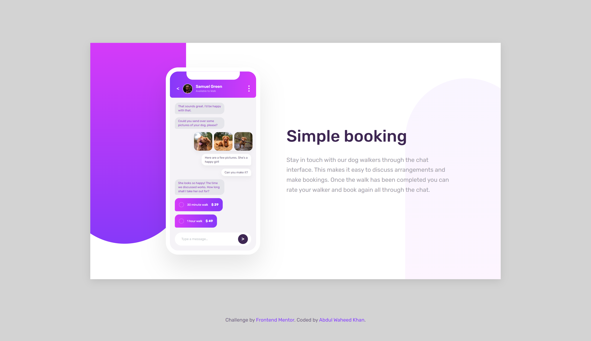
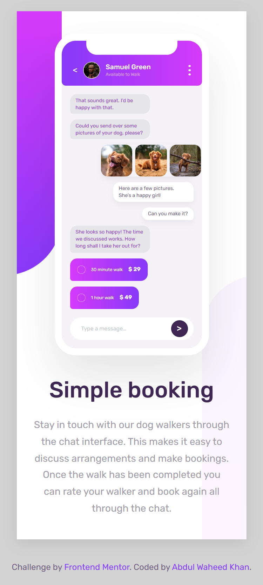

# Chat App CSS Illustration

A fully responsive **chat app UI illustration** built using **pure HTML and CSS**.  
This project was completed as part of a **Frontend Mentor challenge**, where the design was provided and the goal was to replicate it as accurately as possible without using JavaScript.

---

## 🔗 Links

- **Live Demo:**  
  https://waheedkhan10001.github.io/chat-app-css-illustration-master/

- **GitHub Repository:**  
  https://github.com/waheedkhan10001/chat-app-css-illustration-master.git

---

## 🖼 Screenshots

### Desktop View

### Mobile View

---

## 📁 Project Structure

chat-app-css-illustration-master/

├── design/

    ├── desktop-design.jpg

    └── mobile-design.jpg

├── screenshots/

    ├── desktop.png
    └── mobile.png

├── images/

    ├── avatar.jpg

    ├── dog-image-1.jpg

    ├── dog-image-2.jpg

    ├── dog-image-3.jpg

    └── favicon-32x32.png

├── index.html

├── style.css

├── LICENSE

└── README.md

---

## 🛠 Built With

- Semantic **HTML5**
- Modern **CSS3**
- Flexbox for layout
- Pseudo-elements for decorative backgrounds
- Responsive design (desktop & mobile)
- No JavaScript (UI-only challenge)

---

## 🎯 What I Practiced

- Translating a static design into a pixel-accurate UI
- Complex layout composition using Flexbox
- Creating decorative backgrounds using `::before` and `::after`
- Handling shadows, overflow, and clipping correctly
- Responsive scaling without breaking layout
- Writing clean, structured, and readable CSS

---

## 📐 Design Reference

The original design files were provided as part of the challenge and are included in the `design/` folder for reference:

- Desktop design
- Mobile design

---

## 📄 License

This project is licensed under the **MIT License**.  
See the [LICENSE](./LICENSE) file for details.

---

## 🙌 Acknowledgements

- Challenge by [Frontend Mentor](https://www.frontendmentor.io)
- Coded by **Abdul Waheed Khan**

---

## 🚀 Author

**Abdul Waheed Khan**  
Frontend Developer (CSS-focused UI builds)

---

⭐ If you like this project, consider starring the repo!
